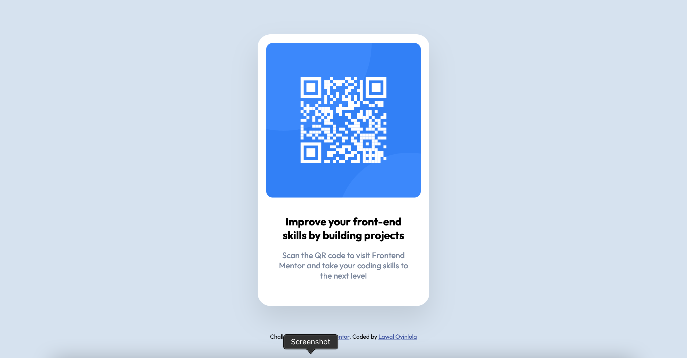

# Frontend Mentor - QR code component solution

This is a solution to the [QR code component challenge on Frontend Mentor](https://www.frontendmentor.io/challenges/qr-code-component-iux_sIO_H). Frontend Mentor challenges help you improve your coding skills by building realistic projects.

## Table of contents

- [Overview](#overview)
  - [Screenshot](#screenshot)
  - [Links](#links)
  - [Built with](#built-with)
- [Acknowledgments](#acknowledgments)

## Overview

This is a responsive design for QR code component challenge on Frontend Mentor using HTML and CSS.

### Screenshot

 

### Links

- Solution URL: [Github sub-repo](https://github.com/lawalOyinlola/frontend_mentor/tree/frontend_mentor/qrcode)
- Live Site URL: [Netlify.QRcode](https://frontendmentorproject-qrcode.netlify.app/)

### Built with

- Semantic HTML5 markup
- CSS custom properties
- Flexbox

## Acknowledgments

Thanks to [@motuncoded](https://github.com/motuncoded) for giving me a tip on how to properly center my content based on the viewport height

